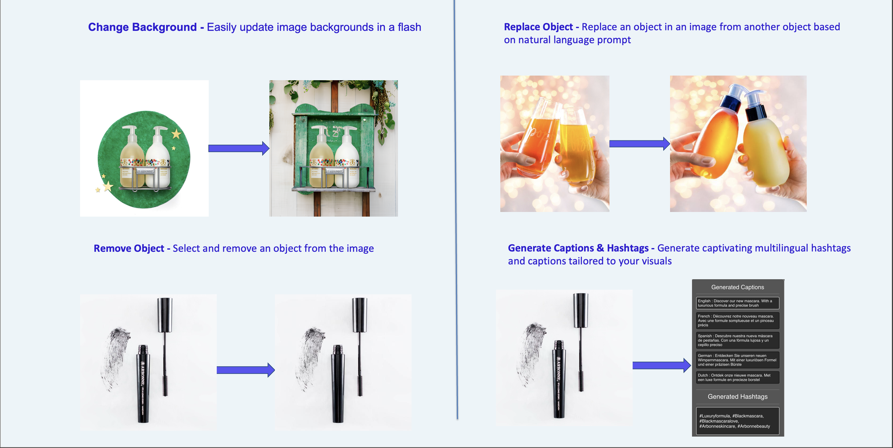

# Social Media Content Creator - Wishing Wand
An AI-based Image Editing and multilingual social media caption and hashtag generator

<h1 align="center">
  <br>
  
  <br>
  <a href="https://github.com/calicartels/Wishing-Wand">Wishing Wand</a>
  <br>
</h1>

<p align="center">
  <a href="#introduction">Introduction</a> •
  <a href="#demo">Wishing Wand Demo Video</a> •
  <a href="#key-features">Key Features</a> •
  <a href="#how-to-use">How To Use</a> •
  <a href="#refernces">References</a> •

</p>


## Introduction

In today's fiercely competitive business landscape, the art of engaging customers through compelling marketing content, particularly in the digital realm, stands as a pivotal strategy for achieving business objectives and cultivating brand loyalty. Nevertheless, many customers often find themselves grappling with the challenge of crafting marketing materials that truly resonate with their target audience. This challenge can be attributed to constraints such as limited resources, skill gaps, and the constant demand for producing top-notch content. It's a common scenario to see Social Media Managers collaborating with external agencies to create their content. However, even the smallest tweaks to the content necessitate extensive back-and-forth communication between the marketing managers and these agencies. This not only drains financial resources but also consumes valuable time. Moreover, time-sensitive campaigns may require Social Media Managers to make content adjustments promptly.

The essence of this hackathon challenge lies in the development of a platform or solution that empowers customers with real-time, AI-enhanced image editing capabilities, granting them the freedom to customize and enhance generated images on the spot. This includes the power to remove, replace, or fill specific elements by simply providing intuitive text prompts. Additionally, the platform will harness a style-based caption generation model to automatically craft captions that are not only contextually relevant but also exquisitely styled, perfectly complementing the visuals. The ultimate goal is to create a solution that is incredibly user-friendly, highly scalable, and accessible to businesses, regardless of their level of technical expertise.


## Wishing Wand Demo Video 

<video controls width="640" height="360">
  <source src="https://github.com/calicartels/Wishing-Wand/blob/main/assets/Demo.mp4" type="video/mp4">
  Your browser does not support the video tag.
</video>


### Key  Features
Edits images and recommends suitable social media captions and hashtags
1. Removes any object in the image
2. Fills the masked object corresponding to the text prompt 
3. Replace the background corresponding to the text prompt
4. Recommends Captions and Hashtags suitable for the selected image



### Model Interpretability using Diffusion Attentive Attribution Maps (DAAM)


## Features
Edits images and recommends suitable social media captions and hashtags
1. Removes any object in the image
2. Fills the masked object corresponding to the text prompt 
3. Replaces the background corresponding to the text prompt
4. Recommends Captions and Hashtags suitable for the selected image


## How To Use
To install this service there are 2 ways. Often, running the service locally allows you to easily change and test the code. If you're ready for productizing, run the service as containerized service.

### Run service locally
Install virtual environment

Step 1 :- Creates a Virtual Environment named "venv"
```commandline
python3.10 -m venv venv
```
Step 2 :- Activate the Virtual environment
```commandline
source venv/bin/activate
```
Step 3 :- Install required packages 
```commandline
pip install -r requirements.txt
```
Step 4 :- Enable sso - Go to home directory and run below command
```commandline
aws sso login --profile sso_profile
```
Step 5 :- Allow SSO on browser
``` 
Select Open
Check that the code is auto filled then Click Next 
Click Allow
```
Step 6:- Run the below command from app folder
```commandline
uvicorn main:app --host 0.0.0.0 --reload
```
Step 7:- Now you can use the integrated docs at:
```commandline http://127.0.0.1:8000/docs
```


